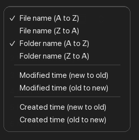
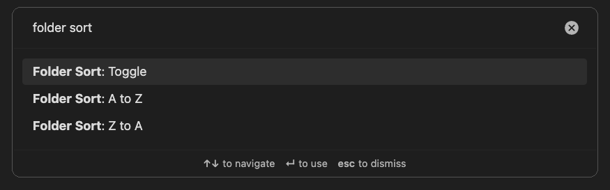

# Folder Sort

Folder Sort is an Obsidian plugin that adds folder sorting to the native File explorer sort menu.

It adds two options directly under Obsidian's file-name sort options:

- Folder name (A to Z)
- Folder name (Z to A)

Folder Sort only reorders folders. Files use Obsidian's built-in file sorting behavior, and the existing folder/file placement is preserved.

## Features

- Sort folders A-Z or Z-A at every File explorer tree level.
- Keep Obsidian's file sorting untouched.
- Use natural, case-insensitive sorting, so `2 Folder` sorts before `10 Folder`.
- Persist the folder sort direction per vault.
- Configure Folder placement as `Existing order`, `Folders first`, or `Folders last`.
- Use the existing File explorer sort menu and command palette commands for sorting.
- Load on desktop and mobile.





## Usage

Open the File explorer sort menu and choose either `Folder name (A to Z)` or `Folder name (Z to A)`.

You can also run these commands from the command palette:

- Folder Sort: A to Z
- Folder Sort: Z to A
- Folder Sort: Toggle

The default direction is A-Z.

Use Settings > Community plugins > Folder Sort to choose the Folder placement mode:

- `Existing order`: sort folders only within their existing folder positions.
- `Folders first`: move sorted folders above files.
- `Folders last`: move sorted folders below files.

## Installation

To install, run the command:

```bash
git clone <repo-url>
cd folder-sort
scripts/install-to-vault.sh "/path/to/your/vault"
```

This installs dependencies, builds the plugin, and copies into your vault.

Then reload Obsidian and enable Folder Sort from Community plugins.