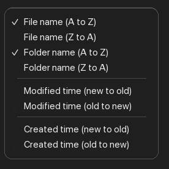
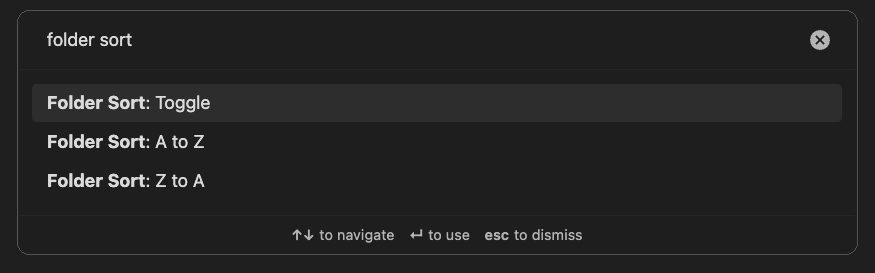

# Folder Sort

Folder Sort is an Obsidian plugin that adds folder sorting to the native File explorer sort menu.

It adds two options directly under Obsidian's file-name sort options:

- Folder name (A to Z)
- Folder name (Z to A)

Folder Sort only reorders folders. Files use Obsidian's built-in file sorting behavior. You can place folders first or last.

## Features

- Sort folders A-Z or Z-A at every File explorer tree level.
- Keep Obsidian's file sorting untouched.
- Use natural, case-insensitive sorting, so `2 Folder` sorts before `10 Folder`.
- Persist the folder sort direction per vault.
- Configure Folder placement as `Folders first` or `Folders last`.
- Use `Folders first` as the default placement.
- Pin folders above other folders with a purple pin marker, or hide folders from the File explorer.
- Use the existing File explorer sort menu and command palette commands for sorting.
- Load on desktop and mobile.

## Usage

Open the File explorer sort menu and choose either `Folder name (A to Z)` or `Folder name (Z to A)`.

You can also run these commands from the command palette:

- Folder Sort: A to Z
- Folder Sort: Z to A
- Folder Sort: Toggle

The default direction is A-Z.

Use Settings > Community plugins > Folder Sort to choose the Folder placement mode. The default is `Folders first`:

- `Folders first`: move sorted folders above files.
- `Folders last`: move sorted folders below files.

The `Hidden folders` panel shows all manually hidden folders. Select `Unhide` beside one folder, or `Unhide all folders` to restore all hidden folders. The `Folder Sort: Show hidden folders` command also restores all hidden folders.

Right-click a folder in the File explorer and use `Pin folder` or `Hide folder` below `Move folder to...`.
Pinned folders stay above other folders and show a purple pin marker on the right. Pinned and hidden folder choices follow folder renames and moves.
